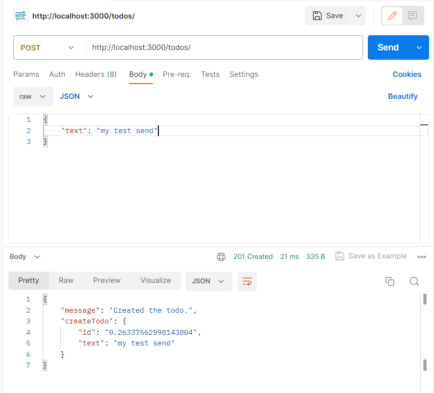
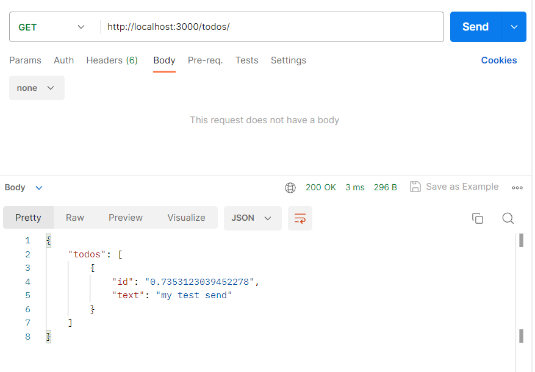
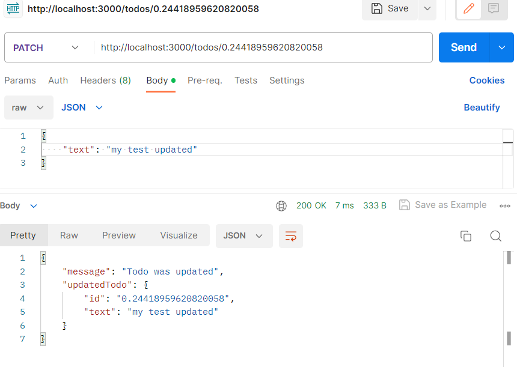
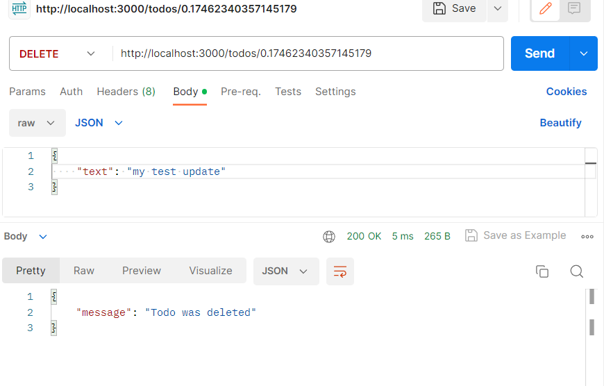

# Notes
## Created api
Post method:

Get method:

Patch method:

Delete method:

## Documentation
Build web applications/REST api with typescript (decorators, interfaces, etc.) - https://docs.nestjs.com/
